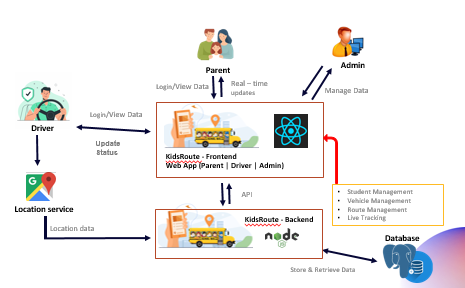

# School Van Management System — Real-Time Tracking and Management

## Team
- **E/22/214**, H.D. Lokugamage, [e22214@eng.pdn.ac.lk](mailto:e22214@eng.pdn.ac.lk)
- **E/22/354**, K.A.H.G.D. Sandeepa, [e22354@eng.pdn.ac.lk](mailto:e22354@eng.pdn.ac.lk)
- **E/22/372**, K.I. Sewmini, [e22372@eng.pdn.ac.lk](mailto:e22372@eng.pdn.ac.lk)
- **E/22/127**, S.I. Gunawardhana, [e22127@eng.pdn.ac.lk](mailto:e22127@eng.pdn.ac.lk)

<!-- Add cover_page.jpg and thumbnail.jpg inside /docs/data -->

## Table of Contents
1. [Introduction](#introduction)
2. [Solution Architecture](#solution-architecture)
3. [Software Designs](#software-designs)
4. [Testing](#testing)
5. [Conclusion](#conclusion)
6. [Links](#links)

---

## Introduction

School transportation management is often handled manually using paper records or informal communication methods, which can lead to inefficiencies, poor coordination, and safety concerns. Tracking student registrations, van routes, schedules, and driver assignments becomes difficult as the number of students and vehicles increases.

The **School Van Management System** is a real-time, web-based platform designed to streamline school van operations. It digitizes the management of students, vans, routes, and schedules, improving safety, transparency, and operational efficiency for parents, drivers, and school administrators.

### Key Capabilities

- 📍 **Real-Time GPS Tracking** — Parents can monitor the exact location of the school van during its journey, ensuring peace of mind.
- 👨‍👩‍👧‍👦 **Multi-Child Monitoring** — A dedicated parent dashboard allows parents to seamlessly track and manage transportation details for multiple children.
- 📋 **Automated Attendance & Journey Logs** — Drivers can record student attendance (boarding/drop-off), with logs securely saved for history and monitoring.
- 🔔 **Real-Time Notifications & SOS** — Built-in announcement features and SOS emergency alerts using WebSockets ensure instant communication in case of delays or emergencies.
- 👥 **Role-Based Access Control** — Dedicated portals for Parents, Drivers, and Administrators with securely validated access.

---

## Solution Architecture

The system follows a three-tier layered architecture separating human interaction, frontend presentation, backend processing, and data/real-time services.



*Figure 1 — School Van Management System Architecture*

### Layer Overview

| Layer | Components | Description |
|---|---|---|
| **Human Layer** | Parent, Driver, Admin | End-users interacting with the system. Parents track vans, drivers update location/attendance, admins manage entities. |
| **Frontend (React)** | Parent Portal, Driver App, Admin Panel | Role-specific React (Vite) single-page applications. Built with Tailwind CSS and Leaflet for map tracking. |
| **Backend (Express)** | API Gateway, WebSocket Server | A Node.js Express service exposing RESTful APIs and Socket.io for real-time location and notifications. |
| **Data Layer** | PostgreSQL (Supabase) | Persistent relational storage for users, students, vans, routes, and attendance records. |

### Data Flow

1. **Driver Operation**: The driver begins a journey from the Driver App, broadcasting real-time GPS coordinates via WebSockets.
2. **Attendance Update**: The driver marks a student as boarded or dropped off, triggering an API call to the backend.
3. **Data Processing**: The Node.js Backend receives the location or attendance data, saving the necessary state to PostgreSQL.
4. **Real-time Broadcast**: The WebSocket server instantly pushes updates to the active Parent portals.
5. **Parent Monitoring**: The Parent Portal updates the map interface and displays notifications of their child's status in real time.

---

## Software Designs

### Technology Stack

**Backend (`code/backend`)**

| Category | Technology |
|---|---|
| Framework | Express 5.2+ |
| Language | TypeScript / Node.js |
| Database | PostgreSQL (via Supabase) |
| Real-time | Socket.io |
| Authentication | JWT (`jsonwebtoken`) & `bcryptjs` |
| Validation | Zod |
| Testing | Jest & Supertest |

**Frontend (`code/frontend`)**

| Category | Technology |
|---|---|
| Framework | React 19 |
| Build Tool | Vite 7 |
| Language | TypeScript / JavaScript (ES6+) |
| Styling | Tailwind CSS |
| Map Services | Leaflet & React-Leaflet |
| Real-time Client | Socket.io-client |
| HTTP Client | Axios |
| Testing | Vitest & React Testing Library |

### Backend Project Structure

```text
code/backend/src/
├── config/              # Environment configurations
├── constants/           # System constants
├── controllers/         # Route request handlers
├── data/                # Data structures
├── middleware/          # Express middlewares (auth, validation)
├── models/              # Database models
├── routes/              # Express API route definitions
├── services/            # Business logic and external integrations
├── sockets/             # Socket.io handlers
├── sql/                 # SQL queries and scripts
├── types/               # TypeScript interfaces
└── validators/          # Zod schemas for input validation
```

### API Endpoints Summary

| Category | Endpoint | Method | Role |
|---|---|---|---|
| **Auth** | `/api/auth/login` | POST | Public |
| **Auth** | `/api/auth/register` | POST | Public |
| **Parents** | `/api/parents/:id` | GET | Parent, Admin |
| **Tracking** | `/api/tracking/location` | POST / GET | Driver, Parent |
| **Journey** | `/api/journey/event` | POST | Driver |
| **Attendance** | `/api/studentBoarding` | POST | Driver |
| **Notifications** | `/api/notifications` | GET | Parent, Driver |

---

## Testing

The project utilizes testing frameworks across the stack to ensure reliability and robustness.

### Test Layers

| Layer | Scope | Tools |
|---|---|---|
| **Backend Unit & Integration** | Controllers, authentication logic, and API endpoints | Jest, Supertest |
| **Frontend Component Tests** | React components, UI states, and map rendering | Vitest, React Testing Library |
| **End-to-End** | Full journey simulation, attendance marking, real-time sync | Manual Testing / Postman |

---

## Conclusion

The School Van Management System successfully delivers a structured and efficient solution for managing school transportation operations. By automating manual processes and introducing real-time capabilities, the system improves operational efficiency, data accuracy, and overall reliability.

Key outcomes of the project:
- A fully functional real-time tracking pipeline leveraging WebSockets.
- A seamless Multi-Child monitoring experience for parents.
- A role-aware web application that adapts its interface and permissions to the specific needs of Parents, Drivers, and Administrators.
- A modular, maintainable PERN stack codebase that handles complex state synchronization.

Future enhancements may include integration with school administration software, support for automated SMS notifications, and predictive route optimization.

---

## Links

- [Project Repository](https://github.com/cepdnaclk/e22-co2060-School-Van-Management-System){:target="_blank"}
- [Project Page](https://cepdnaclk.github.io/e22-co2060-School-Van-Management-System/){:target="_blank"}
- [Department of Computer Engineering](http://www.ce.pdn.ac.lk/){:target="_blank"}
- [University of Peradeniya](https://eng.pdn.ac.lk/){:target="_blank"}
